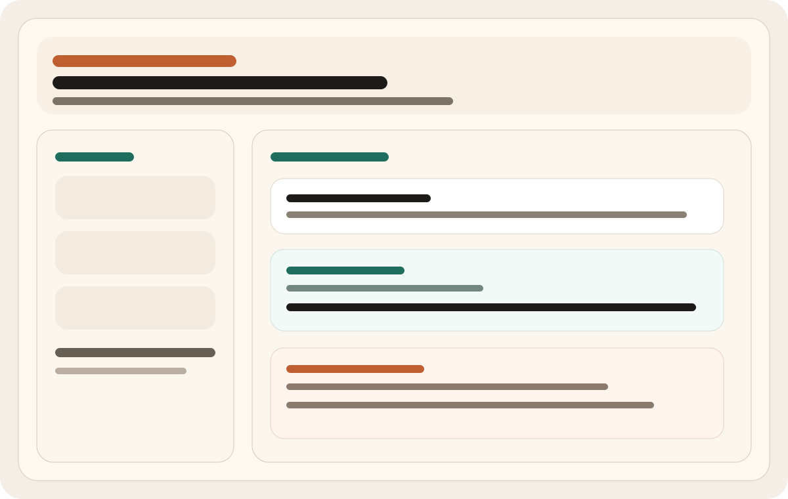
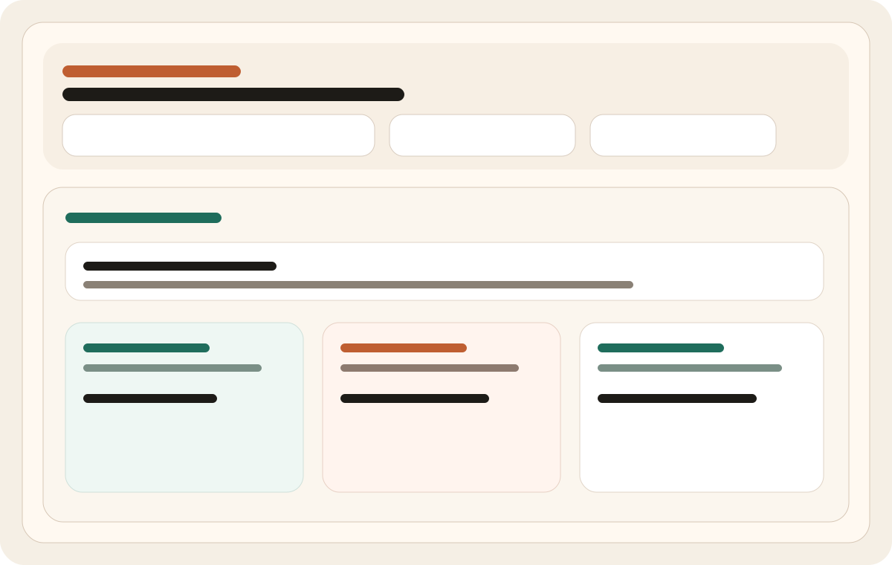
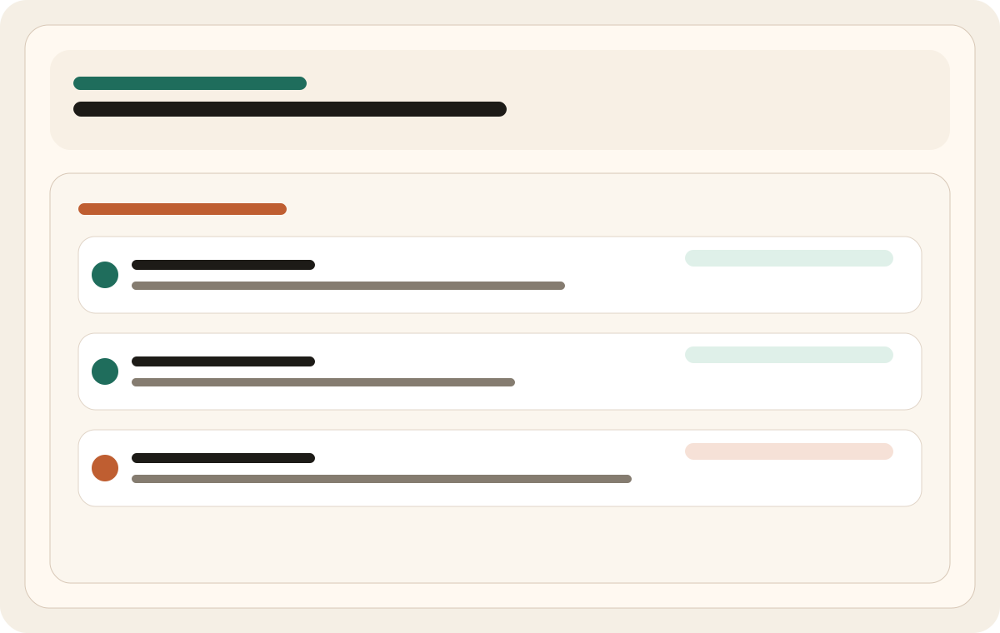

# Local Ollama Agent



وكيل محلي مبني فوق `Ollama` مع:

- Router بين نموذج الكود والرؤية
- ذاكرة قصيرة وطويلة في `sqlite`
- RAG محلي على ملفات مجلد `knowledge/`
- أدوات آمنة للقراءة والبحث وتعديل نصي محدود
- أوضاع تشغيل جاهزة: عام، مبرمج، رؤية، مدير مشروع
- Planner للمهام الطويلة
- Task runs محفوظة مع تقدّم وخطوات مرئية داخل الواجهة
- واجهة ويب محلية تدعم النصوص والصور
- Telemetry بسيط لقياس التشغيل
- Hybrid RAG: embeddings عند توفرها مع fallback معجمي
- مستويات صلاحيات للأدوات: `none`, `read`, `write`
- قوالب مشاريع جاهزة يمكن إنشاؤها مباشرة داخل مساحة العمل
- قائمة محادثات حديثة داخل الواجهة
- حفظ إعدادات محلية من الواجهة
- تصدير/استيراد المحادثات بصيغة JSON
- بناء مشروع كامل داخل مجلد هدف محدد مع `project_spec.json`
- pipeline تنفيذ: `install / run / smoke test / auto-fix notes`

## التشغيل

```bash
python3 run.py
```

ثم افتح:

```text
http://127.0.0.1:8765
```

## المتطلبات

- `Ollama` يعمل محلياً على `http://127.0.0.1:11434`
- النماذج الافتراضية:
  - `qwen2.5-coder:7b`
  - `qwen2.5vl:latest`

## تخصيص النماذج

يمكن تغييرها بمتغيرات البيئة:

```bash
DEFAULT_CHAT_MODEL=qwen2.5-coder:7b
CODE_MODEL=qwen2.5-coder:7b
VISION_MODEL=qwen2.5vl:latest
EMBEDDING_MODEL=nomic-embed-text
DEFAULT_AGENT_MODE=general
OLLAMA_BASE_URL=http://127.0.0.1:11434
```

## المعرفة المحلية

ضع ملفاتك النصية داخل:

```text
knowledge/
```

ثم اضغط "إعادة فهرسة المعرفة" من الواجهة.

## الأمان

- الأدوات المحلية تعمل حسب مستوى الصلاحية المختار: `none`, `read`, `write`.
- أوامر shell محصورة في قائمة آمنة للقراءة فقط.
- الوصول إلى الملفات محصور داخل مساحة العمل الحالية.
- إذا كان نموذج embedding غير متوفر، يعود البحث تلقائياً إلى الفهرسة المعجمية.
- كل محادثة يمكن أن تنتج `workflow run` محفوظاً في قاعدة البيانات مع خطوات ومخرجات.

## القوالب الجاهزة

- `python-api`
- `web-starter`
- `flask-api`
- `fastapi-api`
- `node-api`
- `react-starter`

يمكن إنشاؤها من داخل الواجهة في مجلدات مثل `generated/python-api`.

## Build Full Project

يمكنك الآن:
- كتابة وصف المشروع
- تحديد `Target Directory`
- اختيار السماح بمجلد خارج مساحة العمل عند الحاجة

ثم سيقوم الوكيل بإنشاء:
- scaffold أولي
- `project_spec.json`
- `NEXT_STEPS.md`
- أوامر `install / run / test`

## Landing Page

يوجد Landing بسيطة داخل:

```text
docs/index.html
```

وتعرض لمحة بصرية عن:
- الواجهة
- بناء المشاريع
- تتبع الـ workflows

## Screenshots

### Builder



### Workflow Tracking



## Release v1.0.0

ملاحظات الإصدار موجودة في:

```text
RELEASE_NOTES_v1.0.0.md
```

## Execute Project

بعد إنشاء المشروع يمكنك الآن من الواجهة:
- تثبيت الاعتماديات
- تشغيل المشروع
- تنفيذ smoke test
- الحصول على `AUTO_FIX_NOTES.md` عند الفشل الأولي

مهم:
- التنفيذ يعتمد على الأدوات والاعتماديات المتوفرة في جهازك
- التثبيت قد يفشل إذا كانت الحزم غير متاحة أو الشبكة غير مسموحة

## التشغيل كخدمة

تشغيل محلي مباشر:

```bash
make run
```

تشغيل الاختبارات:

```bash
make test
```

تشغيل عبر Docker:

```bash
docker compose up --build
```

ثم افتح:

```text
http://127.0.0.1:8765
```

ملاحظة:
- الحاوية تتصل بـ `Ollama` على الجهاز المضيف عبر `host.docker.internal:11434`.
- ما زلت تحتاج أن يكون `Ollama.app` أو الخادم المحلي شغالاً خارج الحاوية.

## تهيئة المستودع

تم تجهيز المشروع ليرتبط بسهولة بمستودع Git:

```bash
git init
git add .
git commit -m "Initial local agent"
```

إذا أردت ربطه بمستودع بعيد لاحقاً:

```bash
git remote add origin <your-repo-url>
git branch -M main
git push -u origin main
```

## CI

يوجد ملف GitHub Actions في:

```text
.github/workflows/ci.yml
```

وهو يشغّل:
- `py_compile`
- اختبارات `unittest`

## ملاحظات

- هذا MVP عملي، وليس منصة إنتاجية كاملة.
- إذا كان `ollama` من الطرفية ينهار عندك لكن `Ollama.app` يعمل، فالواجهة ستتصل مباشرة بالـ HTTP API المحلي دون الاعتماد على CLI.
